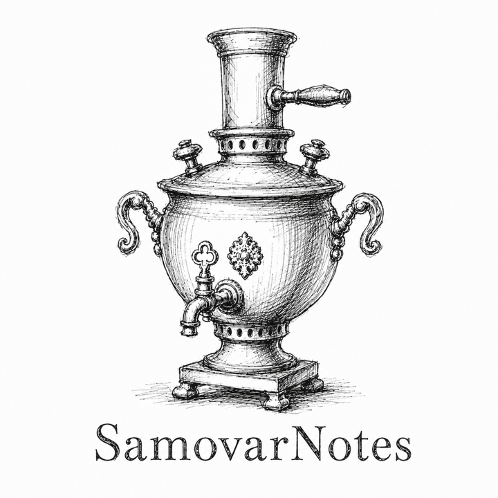

<p align="center">
  
</p>

<h1 align="center">Samovar Notes</h1>

<p align="center">
  A desktop assistant that turns natural language into Notion pages, tables, databases, and research workflows.
</p>

## Overview

Samovar Notes is an open-source Electron app for people who want to create and maintain Notion content through a chat interface. It connects to the user's own OpenAI API key and Notion personal access token, then uses OpenAI tool calling to decide which Notion action to run.

The goal is simple: describe what you want in plain language, and let the app create or update the Notion workspace for you.

Examples:

- Create a blank page named `Project Plan`.
- Create a page with a table for 10 interview candidates.
- Research the best places for a topic and write the result into a Notion table.
- Search existing pages before adding new content.
- Append notes, headings, lists, todos, and structured rows to an existing page.

## What It Can Do

Samovar Notes currently supports:

- Token-based setup with no hosted login service.
- Local encrypted storage for user-provided keys through Electron `safeStorage` when available.
- OpenAI Responses API tool calling for Notion commands.
- OpenAI web research for prompts that need current external information.
- OpenAI voice transcription for short spoken prompts.
- Notion page creation, page search, page reading, and page updates.
- Notion block reading, appending, updating, and archiving.
- Notion database creation, database search, row creation, row updates, and row archiving.
- macOS DMG packaging for a simple desktop install flow.

## How It Works

Samovar Notes does not use OAuth in the open-source desktop flow. Instead, each user brings their own keys:

1. The user saves an OpenAI API key.
2. The user saves a Notion personal access token.
3. The app stores those values locally.
4. Chat prompts are sent to OpenAI.
5. OpenAI chooses which app-owned Notion tool should run.
6. The desktop app executes that tool against the user's Notion workspace.

This keeps the project easy to run locally and avoids shipping any shared client secret inside the app.

## User Setup

For the packaged app, users need two values.

OpenAI API key:

- Create one in OpenAI Platform under API keys.
- Paste it into the Samovar Notes setup screen.
- This key is used for chat, tool calling, research, and voice transcription.

Notion personal access token:

- Create one in Notion Developers under Personal access tokens.
- Give it the Notion API permissions needed to read, insert, and update content.
- Paste it into the Samovar Notes setup screen.
- Do not paste an OAuth client ID, OAuth client secret, or OAuth connection access token here.

The Notion token acts with the access granted by the Notion user who created it. If Notion refuses an action, check that the token has permission to the relevant workspace content.

## Developer Setup

Install dependencies:

```bash
npm install
```

Run the desktop app in development mode:

```bash
npm run start:dev
```

The Electron renderer runs at:

```text
http://127.0.0.1:5173/
```

Optional local overrides can be placed in `.env`. Use `.env.example` as the template. The packaged app does not require `.env` because users enter their keys in the app.

## Build

Build all workspaces:

```bash
npm run build
```

Create the macOS DMG:

```bash
npm run desktop:dist
```

The packaged output is written to:

```text
apps/desktop/release/
```

## Useful Scripts

```bash
npm run typecheck
npm run build
npm run desktop:dist
```

## Project Structure

```text
apps/desktop/          Electron, React, Vite, and desktop-specific logic
packages/core/         Shared types, schemas, and Notion tool definitions
packages/mcp-server/   MCP server package foundation
examples/              Example plans and payloads
docs/assets/           README and documentation assets
```

## Security Notes

- Never commit real OpenAI or Notion tokens.
- User keys are stored locally in the app data directory.
- Electron `safeStorage` is used when the operating system supports it.
- The open-source app uses bring-your-own-token mode only.
- There is no shared OAuth client secret in the packaged desktop app.

## Status

Samovar Notes is an MVP. The core flow is already in place: users can connect local keys, chat with the app, trigger OpenAI tool calling, run research, transcribe voice prompts, and create or update Notion content.

The next product steps are better Notion targeting, richer research workflows, stronger error recovery, and a more polished packaged release.
